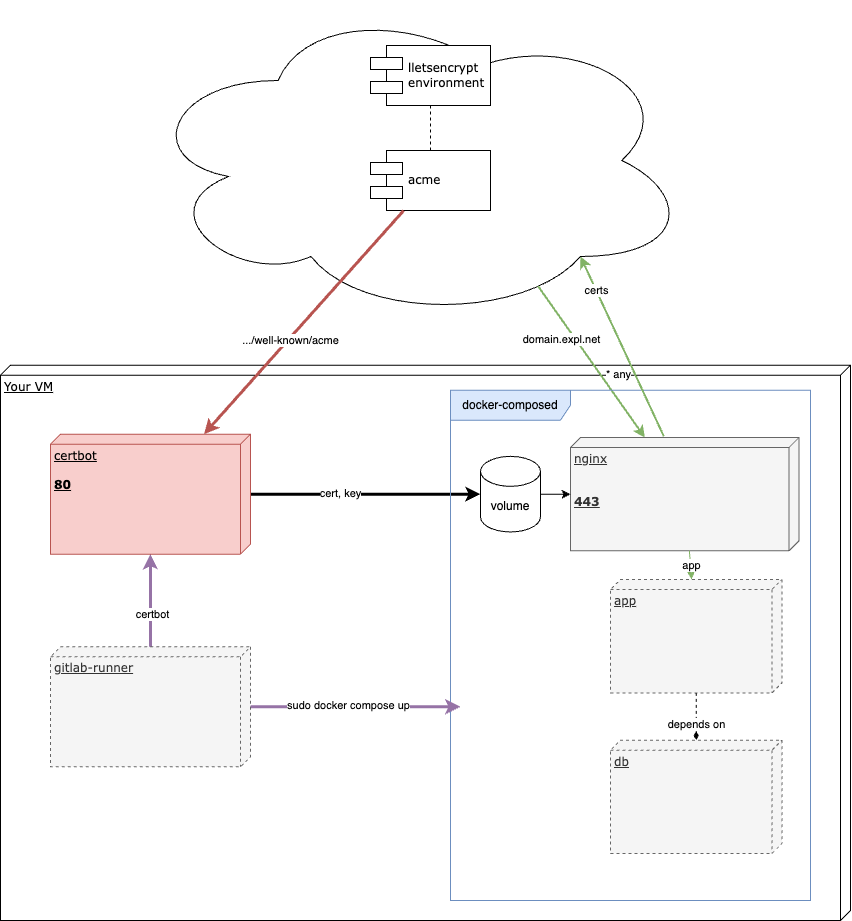

# Certbot template

Проект представляет собой автоматизацию для быстрого выпуска SSL сертфииката для вашего веб-сайта.

## Схема работы автоматизации

Для использования проекта рекоменудется использовать GitLab:

- Уточните ваш домен и мейл в install-certbot.sh
- Задайте переменные для .gitlab-ci.yaml
- Задайте правильные пути до конфигов на своей виртуальной машине в docker-compose.yml

Если у вас возникунт вопросы, пожалуйста напишите мне на joniker.e@mail.ru
